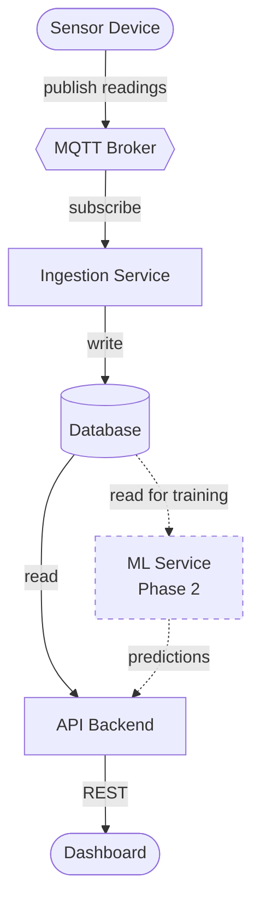

# System Architecture

This document describes the high-level architecture of the Open Water Platform system. It is the mental model contributors should hold in their heads when working on any part of the project. It is intentionally technology-agnostic — specific implementation choices (broker, database, languages, frameworks) are documented separately and may evolve over time. What is described here should not.

## Goals

The system collects water quality data from hardware sensor devices deployed in the field, makes that data available to operators and the wider community through a dashboard, and stores it for historical analysis. Future phases add machine learning for anomaly detection and predictive insights.

The architecture is designed to be:

- **Reliable end-to-end.** Sensor data captured in the field must reach durable storage without loss, independent of the state of any user-facing component.
- **Modular and adoptable.** Each component is replaceable, so a deploying organisation can swap any piece for their preferred implementation.
- **Extensible.** New sensor types, new analytics, and new client surfaces should not require rewriting existing components.

## Diagram

The MQTT broker is drawn as a hexagon because it is off-the-shelf infrastructure, not a service this project builds. Solid arrows are MVP; dashed arrows are Phase 2.

## Components

### Sensor Device

The hardware unit deployed in the field. It measures water quality parameters along with flow rate and volume level, and publishes readings over MQTT. Each device is uniquely identified and includes metadata (firmware version, calibration state, location) with every reading.

The device knows nothing about the rest of the system beyond the MQTT broker. It does not call APIs, does not know about users, and does not need network reachability to anything other than its broker.

### MQTT Broker

A message broker that receives messages from devices and makes them available to any service that subscribes. The broker is shared infrastructure — the project does not implement its own.

The broker is the only piece of the system that field devices need to reach. It serves as the boundary between "the field" and "the backend services."

### Ingestion Service

A backend service whose only job is to take messages from the MQTT broker, validate them against the agreed schema, and write them to the database. It does no business logic, no aggregation, no alerting, no analytics. If it cannot write to the database, it does not silently drop data.

### Database

A single shared database that holds everything: high-frequency sensor readings, device and sensor metadata, user accounts, site definitions, alert configurations, dashboard preferences, and (in Phase 2) model predictions and training metadata.

Although the database is shared, **table ownership is not**. Each table is written by exactly one service:

- The ingestion service writes sensor readings and registers new devices when they first appear.
- The API backend writes everything user-facing (accounts, sites, permissions, alert rules, dashboard configurations).
- The ML service (Phase 2) writes model versions, predictions, and training run records.

Any service may read from any table, but only the owning service may write.

### API Backend

The service that the dashboard and other clients talk to. It exposes endpoints for queries and configuration, reading from the database and returning results in standard request/response form.

The API backend never talks directly to field devices, and field devices never call it. Devices communicate with backend services only through the MQTT broker.

### Dashboard

The frontend application. It calls the API backend for data and configuration changes. It never communicates directly with the database, the broker, or the ingestion service. All writes from the dashboard go through the API backend.

### ML Service (Phase 2)

A separate service added in a later phase. It reads from the database to train models on historical data, and exposes predictions through its own interface that the API backend can call when the dashboard needs them. In some configurations it may also subscribe to the MQTT broker for live inference.

The ML service is deliberately isolated so that compute-heavy work (training runs, inference scaling) does not affect the core data path or the dashboard.

## Data Flow

There are two distinct paths through the system in the MVP, plus a third added in Phase 2.

**Ingest path.** A sensor device publishes a reading to the MQTT broker. The ingestion service consumes it, validates it, and writes it to the database. This is the most critical path in the system — it must work continuously regardless of the state of anything else.

**Serving path.** The dashboard requests data through the API backend, which queries the database and returns the result. This is a standard request/response flow.

**ML path (Phase 2).** The ML service reads from the database for training, produces predictions, and exposes them through an interface the API backend calls when needed.